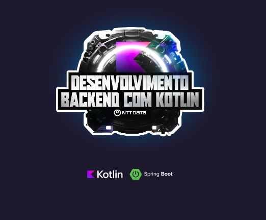

# Coding The Future NTT Data -Desenvolvimento Backend com Kotlin

  

 

O bootcamp Coding The Future NTT Data - Desenvolvimento BackEnd com Kotlin, é um programa da NTT Data em parceiria com a DIO. Com foco na linguagem Kotlin, desenvolvemos nossas habilidades com projetos práticos, desafios de códigos e mentorias com experts do NTTData. 

## Stacks utilizadas

## 🔗 Conecte-se comigo

